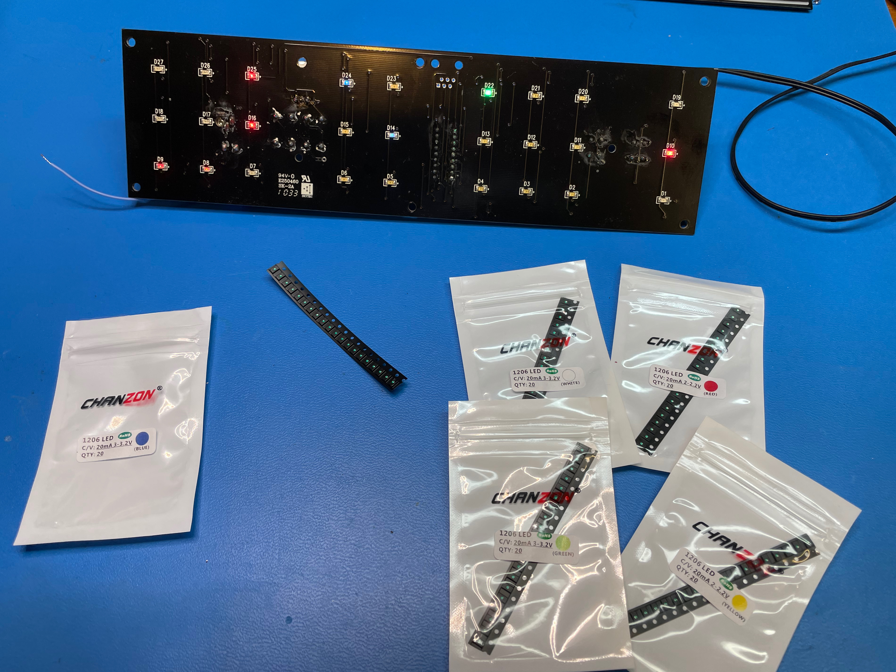
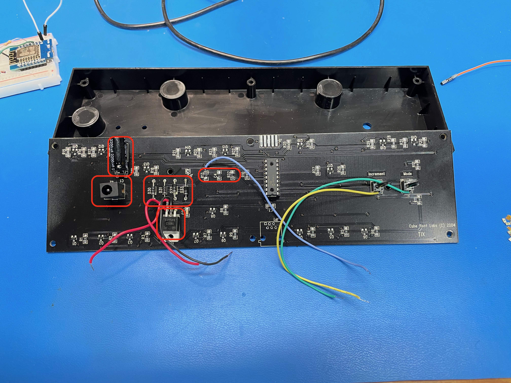

# Classic TIX Clock with NTP Synchronization

I have a thing for interesting clocks, which you can see in my [Binary Clock NTP Project](https://github.com/dgaff/binaryclock). A similar vintage clock I've had for many years is the TIX Clock:

You read the time by counting the number of lit squares for each digit, e.g. it's 12:34 in the picture. To keep things interesting for folks who don't know how to read the clock, the squares change regularly. The clock will still say 12:34, but it will be a different set of dots lit up. This version of the TIX Clock is no longer made, and folks on ebay are selling them for several hundred dollars!! Apparently there's a [version two](https://tixclock.shop/) coming at some point. And, I found a site that does [Tix Clock repairs](https://chronoart.com/TIX.html). There's a lot of love for this clock!

So, fresh off the success of my Binary clock conversion, I decided to put this one on wifi, too. I won't go into quite as much detail as I did with the binary clock, since the conversions are similar. You can read more of the details in the code comments.

## Finished Project

When you plug the clock in, it connects to wifi and then to an NTP server. Then it sets several clock settings and synchronizes the clock display to network time. The clock has 12/24 mode, multiple levels of brightness, multiple LED blink rates, and night mode--when the clock will shut itself off between hard-coded night hours to reduce ambient light in the room and reduce energy consumption. As with the binary clock, this clock was converted to be powered via USB through the ESP8266 board. Here's a video of the clock setting its time:

# More Detailed Steps

## Investigation and LED upgrade

Like the binary clock, this clock was powered by an AC wall wart transformer that was rectified and regulated inside the clock. Also like the binary clock, there was an AC signal coming off the rectifier circuit and into one of the GPIO pins on the PIC chip. In the binary clock's case, it was a master reset. For the TIX clock, it's controlling the LED blink rate. So, I had to mimic that 60 Hz AC pulse into the PIC chip using the ESP8266 board in order for the clock's LEDs to refresh. More on that below.

The other problem with this clock was that the LEDs were really dim after years of use. I decided to swap them out with newer, brighter LEDs that also use less power. You can see the brightness difference in the two photos below. To keep things interesting, I also replaced the red LEDs with white LEDs on the the first digit of the clock hours. This gives each clock digit a different color.

## Replicating the 60 Hz sine wave

There are 3 update modes for the clock: LEDs change every second, every 4 seconds, or every minute. As noted, the LEDs don't refresh at all until that AC sine wave is present. ~~I'm not sure if this sine wave also controls the secondhand of the clock. If so, that feels pretty inaccurate to me, and I would expect that the internal oscillator on the PIC would be used as the time reference instead. I guess we'll see if there's any clock drift.~~ I ended up emailing with Guido Seevens, who is building version 2 of the TIX Clock. He shared a bunch of really helpful information about the original clock. First off, the original TIX Clock designer, Jim Thompson, unforuntatley passed away. Guido did confirm that the 60 Hz is used as the time reference. There were two versions of the TIX clock to match region AC frequency - 60 Hz and 50 Hz. Given that I know for certain that I'm not perfectly generating 60 Hz, there will be some drift. However, I have night mode on by default, so the clock will reset its time every morning. That's probably accurate enough.

Anyway, to replicate this sine wave, I created a digital pulse train using a timer interrupt. While a pulse train is not an AC sine wave, I'm guessing the clock's code in the PIC chip counts edges, and this digital pulse train seemed to work fine. Another tricky aspect is that the AC pulse train must be present in order to setup other clock functions. It took me a while to figure out that.

I originally try to bit-bang the frequency in the main loop of the code, but I soon realized that wasn't going to work well with all of the delays required after sending other digital signals to control the clock. Thankfully, the Arduino platform supports user-defined interrupts, which I didn't know until I started this project.

## Prototyping the circuit

Controlling the clock itself was straightforward. I used a transistor to enable power to the clock. To turn the clock on, I must switch this transistor on and then turn on the AC sine wave, which is equivalent to what happens with the original power supply. To turn the clock off or to reset the clock, both the transistor and the sine wave must be turned off.

I had a second problem when switching off the sine wave digital output in the ESP8266. Even at logic 0, the LEDs were lighting, just very dimly. I put a diode inline from ESP8266 to PIC, and that fixed it. So I guess the ESP8266 was sourcing some current from the PIC, although I'm not really sure why. Again, I don't really know how the PIC is setup or what code is running on it, so it's trial and error to figure things out.

Finally, the Increment and Mode buttons on the TIX Clock were easily switched digitally from the ESP8266. Logic 0s act as button presses.

## Removing the old AC components

To make room for the new electronics, I pulled out the AC-to-DC circuit. I needed to remove the power connector anyway, so I decided to pull out the rest, too. That left a place for both the transistor and for the ESP8266 board. The picture below shows all of the components to remove.

## Permanent wiring of the transistor and diode

I was even more lazy on this one than I was on the binary clock. With all of the extra board space, I decided to just mount the transistor right where the regulator used to be. You can see resistor Rb bulging under heat shrink tubing. The protection diode on the AC sine wave input is also hiding under some heat shrink. I used hot glue to affix and protect everything. Sometimes the simplest solutions are the best!

## Reassembly

There's a lot of empty space in this case, and the ESP8266 board fit nicely in the corner. As with the binary clock, I hardwired the USB pigtail to the board. We'll see it it holds up over time!

